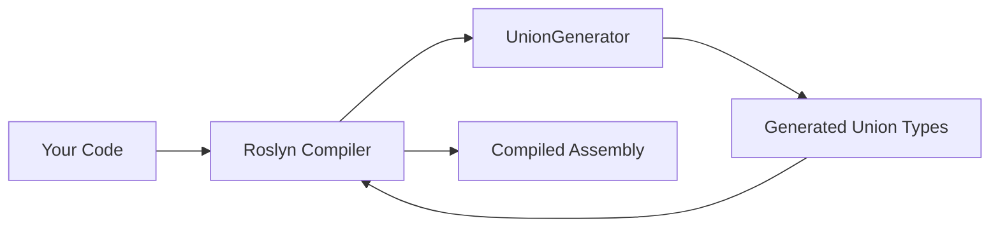

# What is UnionGenerator?

**UnionGenerator** is a powerful C# source generator that brings compile-time discriminated unions to .NET. It eliminates boilerplate code, enables type-safe error handling, and provides exhaustive pattern matching—all with **zero runtime overhead**.

## The Problem

Traditional C# development often forces you to choose between:

- **Exceptions**: Expensive, implicit control flow that hides error paths
- **Nullable types**: Limited to null/value, requires defensive coding
- **Boolean flags**: Not type-safe, doesn't scale beyond two states
- **Manual union types**: Tons of boilerplate, easy to get wrong

```csharp
// Traditional approach - fragile and verbose
public class ApiResponse
{
    public bool IsSuccess { get; set; }
    public string? Data { get; set; }
    public string? Error { get; set; }
    public int? ErrorCode { get; set; }
}

// Problems:
// ❌ Nothing prevents Data AND Error from being set
// ❌ No compile-time guarantees
// ❌ Easy to forget error handling
// ❌ Null reference warnings everywhere
```

## The Solution

UnionGenerator generates **discriminated union types** at compile time using Roslyn source generators. You get:

✅ **Type Safety**: Only one case can be active at a time  
✅ **Zero Runtime Cost**: All checks compile away to simple field access  
✅ **Exhaustive Matching**: Compiler ensures you handle all cases  
✅ **Rich IDE Support**: Full IntelliSense, refactoring, and debugging  
✅ **No Reflection**: Pure compile-time code generation  

```csharp
using UnionGenerator.Attributes;

[GenerateUnion]
public partial class Result<T, E>
{
    public static Result<T, E> Ok(T value) => new OkCase(value);
    public static Result<T, E> Error(E error) => new ErrorCase(error);
}

// Usage
var result = await FetchDataAsync();

return result.Match(
    ok: data => Ok(new Response(data)),
    error: err => BadRequest(err.Message)
);
```

## Key Features

### 🔥 Zero Boilerplate

Define your union with just an attribute. UnionGenerator handles the rest:
- Case classes
- Pattern matching properties
- `Match()` methods
- Equality and comparison
- JSON serialization support

### ⚡ Compile-Time Generation

Everything is generated during compilation:
- No runtime reflection
- No performance penalty
- Fully debuggable generated code
- Integrates with your IDE

### 🛡️ Type-Safe by Design

The type system prevents invalid states:
- Only one case can be active
- Compiler errors if you miss a case
- No null reference exceptions
- Clear, explicit error handling

### 🔌 Framework Integration

First-class support for popular .NET frameworks:
- **ASP.NET Core**: Automatic `ProblemDetails` mapping
- **Entity Framework Core**: Value converters for database storage
- **FluentValidation**: Error union integration
- **OneOf**: Migration helpers for existing codebases

## How It Works

UnionGenerator uses **Roslyn source generators** to analyze your code during compilation and generate additional C# classes that make up your union type.



1. You annotate a `partial class` with `[GenerateUnion]`
2. UnionGenerator analyzes your static factory methods
3. It generates case classes, properties, and methods
4. Everything is available in your IDE immediately
5. The compiler produces optimized IL with zero overhead

## When to Use UnionGenerator

UnionGenerator is perfect for:

- ✅ **Error handling**: Replace exceptions with `Result<T, E>` types
- ✅ **State machines**: Model application states explicitly
- ✅ **Domain modeling**: Represent business logic with unions
- ✅ **API responses**: Type-safe success/error handling
- ✅ **Optional values**: Better than `Nullable<T>`
- ✅ **Command/Query results**: CQRS patterns
- ✅ **Parser results**: Success/failure with context

## Next Steps

Ready to get started? 

- [Learn why discriminated unions matter](./why-discriminated-unions)
- [Explore key features in depth](./key-features)
- [Install and set up](./installation)
- [Build your first union](../getting-started/your-first-union)
